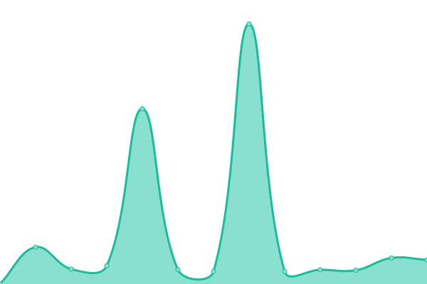

# [📈 Live Status](https://sys.stjohn.edu.et): <!--live status--> **🟩 All systems operational**

This repository contains the open-source uptime monitor and status page for [Aaron Kebede](www.kebede.org), powered by [Upptime](https://github.com/upptime/upptime).

With [Upptime](https://upptime.js.org), you can get your own unlimited and free uptime monitor and status page, powered entirely by a GitHub repository. We use [Issues](https://github.com/aaronkebede/s/issues) as incident reports, [Actions](https://github.com/aaronkebede/s/actions) as uptime monitors, and [Pages](https://sys.stjohn.edu.et) for the status page.

<!--start: status pages-->
<!-- This summary is generated by Upptime (https://github.com/upptime/upptime) -->
<!-- Do not edit this manually, your changes will be overwritten -->
<!-- prettier-ignore -->
| URL | Status | History | Response Time | Uptime |
| --- | ------ | ------- | ------------- | ------ |
|  [St John LMS](https://classroom.google.com/a/stjohn.edu.et) | 🟩 Up | [st-john-lms.yml](https://github.com/aaronkebede/sj-status/commits/HEAD/history/st-john-lms.yml) | 

 215ms
     
 | 

<a href="https://sys.stjohn.edu.et/history/st-john-lms">100.00%</a>
    

|  [Main Wesbite](https://stjohn.edu.et) | 🟩 Up | [main-wesbite.yml](https://github.com/aaronkebede/sj-status/commits/HEAD/history/main-wesbite.yml) | 

 330ms
     
 | 

<a href="https://sys.stjohn.edu.et/history/main-wesbite">99.67%</a>
    

|  [Email and Workspace Services](https://mail.google.com/a/stjohn.edu.et) | 🟩 Up | [email-and-workspace-services.yml](https://github.com/aaronkebede/sj-status/commits/HEAD/history/email-and-workspace-services.yml) | 

 139ms
     
 | 

<a href="https://sys.stjohn.edu.et/history/email-and-workspace-services">100.00%</a>
    

|  [LTS](https://lts.stjohn.edu.et) | 🟩 Up | [lts.yml](https://github.com/aaronkebede/sj-status/commits/HEAD/history/lts.yml) | 

 567ms
     
 | 

<a href="https://sys.stjohn.edu.et/history/lts">99.67%</a>
    

|  [St John News Repository](https://news.stjohn.edu.et) | 🟩 Up | [st-john-news-repository.yml](https://github.com/aaronkebede/sj-status/commits/HEAD/history/st-john-news-repository.yml) | 

 401ms
     
 | 

<a href="https://sys.stjohn.edu.et/history/st-john-news-repository">99.68%</a>
    

|  [IC LMS](https://interactclub.stjohn.edu.et) | 🟩 Up | [ic-lms.yml](https://github.com/aaronkebede/sj-status/commits/HEAD/history/ic-lms.yml) | 

 1225ms
     
 | 

<a href="https://sys.stjohn.edu.et/history/ic-lms">99.48%</a>
    

|  [St John IT Help Desk](https://help.stjohn.edu.et/portal/en/home) | 🟩 Up | [st-john-it-help-desk.yml](https://github.com/aaronkebede/sj-status/commits/HEAD/history/st-john-it-help-desk.yml) | 

 928ms
     
 | 

<a href="https://sys.stjohn.edu.et/history/st-john-it-help-desk">99.69%</a>
    

<!--end: status pages-->

[**Visit our status website →**](https://sys.stjohn.edu.et)

## 📄 License

- Powered by: [UPT](https://github.com/aaronkebede/sj-status)
- Code: [MIT](./LICENSE) © [Aaron Kebede](www.kebede.org)
- Data in the `./history` directory: [Open Database License](https://opendatacommons.org/licenses/odbl/1-0/)
